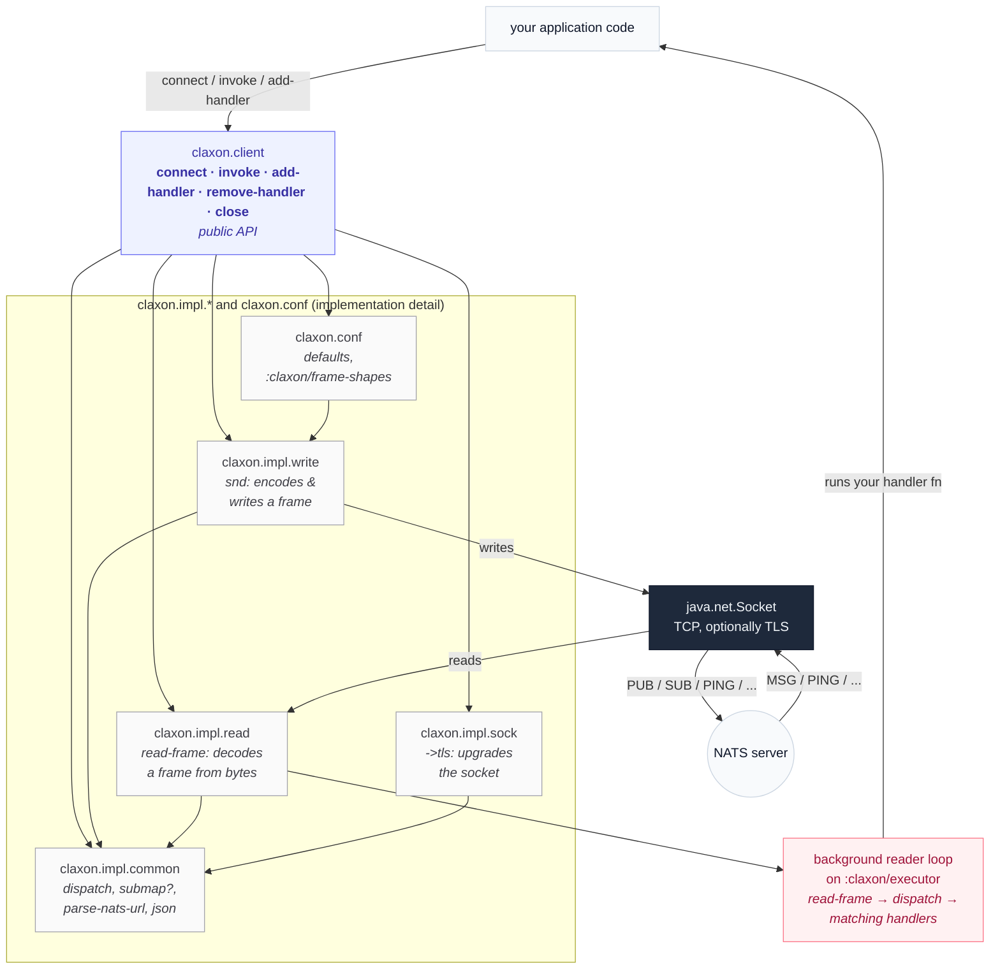

# Rationale

Most Clojure NATS clients are thin wrappers around the official Java SDK (`nats.java`). That's a perfectly reasonable choice, but it comes with a JVM tax: you get nats.java's threading model, its option-builder classes, and a hard dependency on a full JVM, which means no runtimes like Babashka.

claxon takes the other path. The [NATS client protocol](https://docs.nats.io/reference/reference-protocols/nats-protocol) is a small, text-based, line-oriented protocol. claxon implements the protocol directly against a plain `java.net.Socket`, using nothing but Clojure data to describe the wire format with the following goals:

- **Babashka-compatible.** claxon runs as a script, in a `bb.edn` project, or embedded in a larger bb-based tool, with no AOT compilation and no native dependencies beyond the JVM/GraalVM that bb already ships.
- **Small, inspectable and flexible** The entire protocol surface is described as data in one map (`claxon.conf/defaults`'s `:claxon/frame-shapes`) ops, their arguments, and their payloads. Reading and writing frames are both generic interpreters over that data, not one function per operation. Additionally, the default protocol behaviour can be influenced and new things added, all from the userland.
- **Lightweight.** No dependency on `nats.java`. The only third-party dependency is a JSON library (`clojure.data.json` on the JVM, nothing on bb), used only for `INFO`/`CONNECT` payloads.
- **Data in, data out.** Frames are Clojure maps. Connecting, publishing, subscribing, and handling messages are all just `assoc`-able data.

claxon is deliberately a _protocol_ client, not a full-featured NATS SDK.
It doesn't try to be a drop-in replacement for nats.java's surface area, see [Roadmap](#roadmap) for what's intentionally left out for now.

## Design

## Comparison to other Clojure NATS clients

| aspect                    | claxon                       | [clj-nats](https://github.com/cjohansen/clj-nats) | [monkey-projects/nats](https://github.com/monkey-projects/nats) |
| ------------------------- | ---------------------------- | ------------------------------------------------- | --------------------------------------------------------------- |
| Underlying impl           | Pure Clojure, raw sockets    | Wraps `nats.java`                                 | Wraps `nats.java`                                               |
| Babashka compatible       | **Yes**                      | No                                                | No                                                              |
| User modifiable protocols | **Yes**                      | No                                                | No                                                              |
| Dependencies              | data.json on JVM, none on bb | `nats.java` + its transitive deps                 | `nats.java`                                                     |
| Protocol description      | Data-driven                  | Delegated to nats.java                            | Delegated to nats.java                                          |

## Roadmap

The following are **not yet implemented** but planned (based on asks/issues) in order of priority:

- **Custom TLS CAs**: It uses the system store as of now, support for specifying a CA file could be added.
- **TLS-first handshake**: Support no plain text connections as described [here](https://docs.nats.io/running-a-nats-service/configuration/securing_nats/tls#tls-first-handshake).
- **WebSocket transport.** Only raw TCP sockets are supported as of now.
- **Editor integration** Since the protocol is spec driven, clj-kondo/clojure-lsp can be hooked in to provide real time feedback on function calls.
- **Advanced Authentication** No NKey/JWT signing of the `INFO` nonce yet.
- Maybe JetStream abstractions.
- Something else? Please raise an issue.
